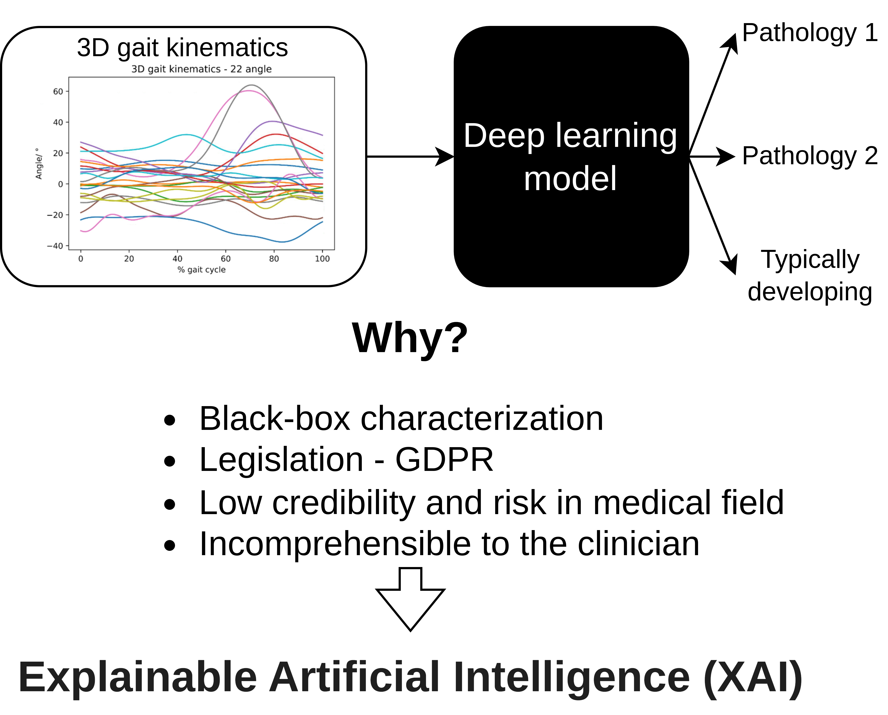
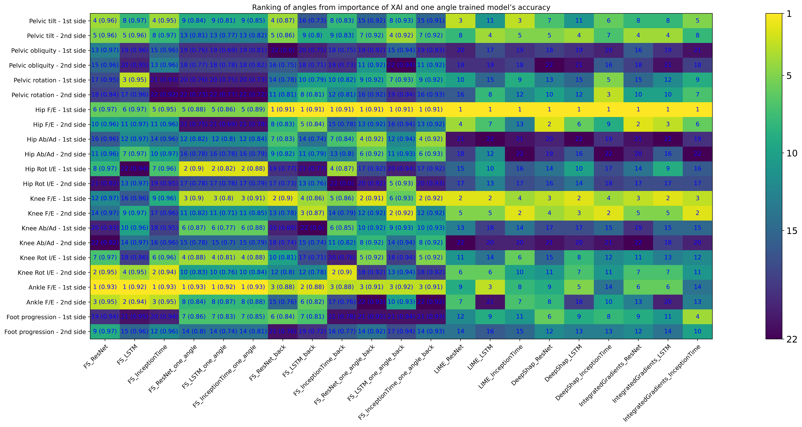

# Explaination of deep learning classification methods of 3d kinematic data for neurological gait disorders by Explainable Artificial Intelligence(XAI)

This project is based on the work of paper: [Towards a diagnostic tool for neurological gait disorders in childhood combining 3D gait kinematics and deep learning](https://www.sciencedirect.com/science/article/pii/S0010482524001793) ([Github link](https://github.com/LANZhengyang/Gait_DeepLearning_Diagnostic_Tool) and [bibtex here for citation](https://github.com/LANZhengyang/Gait_DeepLearning_Diagnostic_Tool/blob/main/citation.bib)). <br>
In our previous work, by combining deep learning and 3D gait kinematics a diagnostic tool for neurological gait disorders was realized.

In this project, this deep learning based diagnostic tool will be combined with the XAI methods to mitigate the black box characteristics of deep learning models. 


Five different XAI methods were used in this project:
- Local Interpretable Model-agnostic Explanations (LIME)
- Deep SHAP
- Integrated gradients
- Sequential Feature Selection - backward
- Sequential Feature Selection - forward

# Result overvoew


### Each column represents the results of one XAI method:
Columns 1 to 3 are the results of the best angle of the forward feature selection. <br>
Columns 4 to 6 are the results of the first round of the forward feature selection. <br>
Columns 7 to 9 are the results of the best angle for the backward feature selection. <br>
Columns 10 to 12 are the results of the first round of the backward feature selection. <br>
Columns 13 to 21 are the results for LIME, DeepShap, Integrated gradients.


The number in the box represents the importance ranking of this angle. For feature selection, the number after the ranking is the accuracy in this case to evaluate the level of difference in accuracy across ranked angles.

## Install

The implementation is base on Python 3.9.11. 

First clone the project
```
git clone https://github.com/LANZhengyang/XAI_Gait_DeepLearning_Diagnostic_Tool.git
cd XAI_Gait_DeepLearning_Diagnostic_Tool
```
The dependencies of this project can be installed by:

```
pip install -r requirements.txt
```

## How to use it

### LIME, Deep SHAP and Integrated gradients:
You should train the model first. And run:
```
python XAI_methods.py
```
Computing XAI all at once requires a lot of memory for a large number of inputs (LIME style in [XAI_methods.py](https://github.com/LANZhengyang/XAI_Gait_DeepLearning_Diagnostic_Tool/blob/7f04db4cb576a8d0d4c920d18ff60a776fe01ee9/XAI_methods.py#L52-L86)). Computing it multiple times separately can alleviate the memory shortage problem. (DeepShap style in [XAI_methods.py](https://github.com/LANZhengyang/XAI_Gait_DeepLearning_Diagnostic_Tool/blob/7f04db4cb576a8d0d4c920d18ff60a776fe01ee9/XAI_methods.py#L104-L139))


### For the feature selection:
For the Sequential Feature Selection - forward for ResNet, you should run:
```
python Feature_selection_forward.py
```
For the Sequential Feature Selection - backward for ResNet, you should run:
```
python Feature_selection_backward.py
```
The network can be changed by modified Net_name to "ResNet", "LSTM" or "InceptionTime".

### To evaluate the LIME, Deep SHAP and Integrated gradients:
[XAI_total_relevance_Norm_TDvsCPu.ipynb](https://github.com/LANZhengyang/XAI_Gait_DeepLearning_Diagnostic_Tool/blob/main/XAI_total_relevance_Norm_TDvsCPu.ipynb) can plot and save XAI visualized results for three networks.

### To evaluate the the feature selection:
You should run:
```
python Feature_selection_evaluation_TDvsCPu.py
```
It can save the results of the best angle of the forward feature selection and the results of the first round of the forward feature selection for three networks.

### Compare all XAI result:
When all XAI results are available. <br>
[Plot_TDvsCPu_all_XAI.ipynb](https://github.com/LANZhengyang/XAI_Gait_DeepLearning_Diagnostic_Tool/blob/main/Plot_TDvsCPu_all_XAI.ipynb) can be used to plot and compare all results.

### Other XAI results:
Other XAI methods can be added as well, just make sure that the output of the XAI method is the importance ranking of the feature and customize the [Plot_TDvsCPu_all_XAI.ipynb](https://github.com/LANZhengyang/XAI_Gait_DeepLearning_Diagnostic_Tool/blob/main/Plot_TDvsCPu_all_XAI.ipynb) to add it.

### To use your own dataset:
You should customize the location, name and list of accumulated index of your dataset(details can be found [here](https://github.com/LANZhengyang/Gait_DeepLearning_Diagnostic_Tool)).
